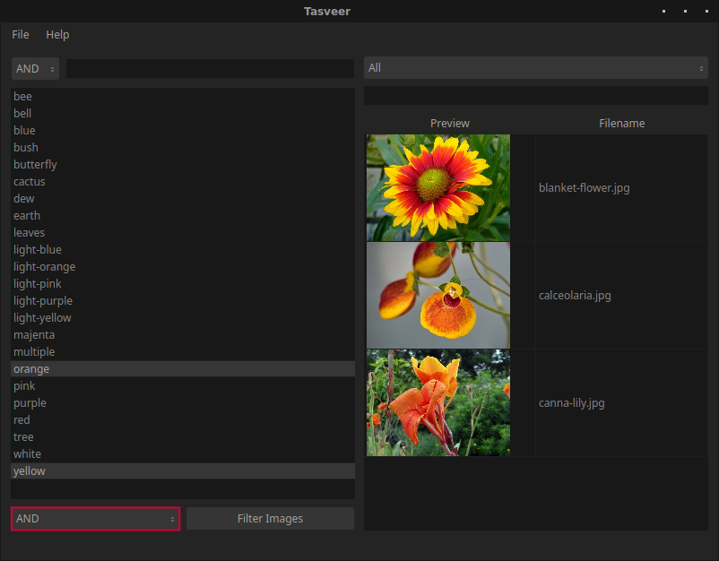

<p align="center">
  
</p>
<h1 align="center">Tasveer</h1>
<p align="center">
  A simple image browsing and tagging application
</p>

## Description
Tasveer is a minimalistic Qt application made for browsing and tagging images
easily. It supports most common image formats.

Native QT support:

- `jpg`
- `png`
- `gif`
- `svg`
- `bmp`
- `pbm`
- `pgm`
- `ppm`
- `xbm`
- `xpm`

With plugin support:

- `webp`
- `tiff`
- `cr2`
- `nef`
- `dng`

For more details, see
[Image formats](#image-formats) and
[Adding image formats](#adding-image-formats) sections.

## Screenshot


## Features
- New directories can be added by the `File > Add Directories` menu.

- New single image can be added by the `File > Add Image` menu.

- New tags can be added by the `File > Add Tags` menu.
All characters are allowed except semicolons, which are used to separate tags.
In the dialog, enter the tags you want separated by semicolons. You'll see
buttons get added to the dialog as you type a tag and then a semicolon.
Note that even if you want to add a single tag, you'll have to end it with a
semicolon to actually add it.


- Tags are displayed on the left. These can be filtered by typing in the box
above the section. Filtering tags by multiple strings is possible by separating
the strings by semicolons. Two methods of tag filtering are available: `OR` and
`AND`.


- Added images are displayed on the right. These can be filtered by name by
typing in the box above the section.


- Tags can be linked to an image by dragging and dropping them on the desired
image. Multiple tags can be selected and dropped at once.

- Images can be filtered by tags by selecting desired tags and clicking the
`Filter images` button below the tag section. Two methods of filtering are
available: `OR` and `AND`.




- Images can be filtered by the directory they're in by selecting directories
in the dropdown menu above the images section.

- `Show untagged images only` checkbox can be checked to show only images
without any linked tags. If any tag is selected in the tag list, this checkbox
is disabled. As a result, this can only be used without any tags selected
(because if you have a tag already selected, it means you are about to/already
have images filtered by tags, making this useless).

- Tags linked to an image can be viewed by right clicking an image and
selecting `Show Tags`. A tag can be removed from an image by clicking on its
button and then confirming. The tags will not get removed unless you press
`OK` after removing desired tags.


- An image can be opened in the default image viewing application by
double-clicking on it.

- Images can be dragged and dropped to any location that supports dropping
images (file managers, browsers, etc).

- Images can be removed from the database by right-clicking, selecting
`Remove Image` and confirming. This won't delete files on disk.

- **Note**: To deselect an item (tag or image), press `Ctrl` and click the left
mouse button.

## Shortcuts
- `Ctrl+D`: Open `Add directory` menu.
- `Ctrl+I`: Open `Add image` menu.
- `Ctrl+T`: Open `Add tags` menu.
- `Ctrl+S`: Set focus to tag filter search box.
- `Ctrl+Z`: Set focus to image filter search box.
- `Ctrl+U`: Toggle `Show untagged images only` checkbox, if enabled.
- `Ctrl+Q`: Quit.

## Image formats
All image formats supported
[natively](https://doc.qt.io/qt-6/qimagereader.html#supportedImageFormats)
by `QImageReader` are supported. Additional image formats are supported through
QT image formats plugins (`webp` and `tiff`).

Some common RAW image formats (`cr2`, `nef` and `dng`) are read by the `tiff`
plugin.

## Adding image formats
Additional image formats, if supported by other plugins installed on your
system, can be added by adding the extensions to the `fileTypes` list in the
`include/filetypes.h` header file.

For instance, if support for `crw`, `arw` or `raf` files are needed, just
install the [`QTRaw`](https://gitlab.com/mardy/qtraw) plugin and add
the extensions to the `fileTypes` list.

**Note**: If `QTRaw` is installed, `cr2`, `nef` and `dng` files will also be
read through it. And `QTRaw` seems like it could be improved a lot. It seems to
"auto-rotate" portrait images which look odd in the thumbnails. So, I'd suggest
against using it. The QT `tiff` plugin seems to be a lot better, albeit a
little slower.

## Building and Installing
For all image format support, it's recommended to install the
QT image formats plugins.
Under debian and derivatives, they can be installed with:

```bash
sudo apt-get install qt5-image-formats-plugins
```

After installing the plugins, run the following commands to build and install:
```bash
qmake && make
sudo make install
```
